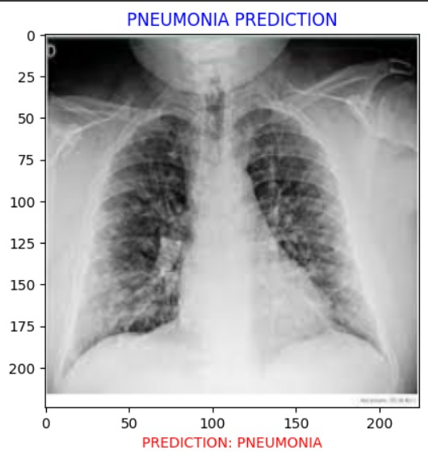

# Pneumonia Prediction with EfficientNetB0

## Overview
This project focuses on predicting pneumonia using a machine learning model trained on the EfficientNetB0 architecture. With a solid 79% accuracy, the model showcases efficient feature extraction, making it a valuable tool for medical diagnostics.

## Features
- *Efficient Model:* Utilizes EfficientNetB0 for feature extraction.
- *Accuracy:* Achieves an accuracy of 79% on the provided dataset.
- *Data Source:* Kaggle dataset forms the foundation for training and testing.

## Objective
Develop a machine learning model for pneumonia prediction using chest X-ray images and transfer learning.

## Data
- *Source:* Kaggle dataset- [Chest X-Ray Images (Pneumonia)](https://www.kaggle.com/datasets/paultimothymooney/chest-xray-pneumonia)
- *Preprocessing:* Divided the training images into batches of 32 for better results in training

## Model
- *Architecture:* EfficientNetB0 as the feature extraction layer and a Dense output layer
- *Training:* Trainable parameters are 2049/ 23566849
    - *Optimizer:* Adam
    - *Loss Function:* binary_crossentropy

## Evaluation
- *Accuracy:* 79%

## Results
The model achieved an accuracy of 79% in pneumonia prediction.
